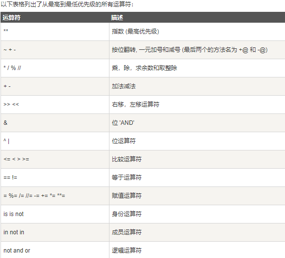
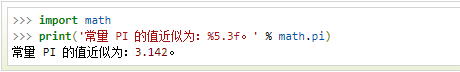
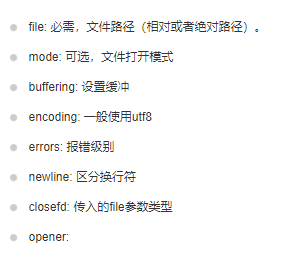

## python基础学习  


### PYTHON   

目录:  
1. 基础语法：python的语言规范，就行汉语中 的语言规范  
2. 变量:  代码是对  现实世界的抽象，现实世界的数据要用python并表示就必须存储，那就是变量。  
3. 代码逻辑结构: 代码规范，python编译器等等，你要让他识别就必须符合python规范  
4. 函数 : 也是一种封装，封装就是 1.方便使用，减少代码写在一起太长太乱     2.可以直接调用，随时调用  
5. 面向对象： 另一种封装，更加高级的封装，功能和函数差不多的，都是为了  方便调用，方便使用。    
6. 常见的 python包  


---
####  python基础语法  
* 标识符：对对象引用起的一个名字 
   --第一个字符必须是字母表中字母或下划线
* 保留字符: 关键字，不能作为标识符
    --基础：False, True, None, and, def, elif, else, for, from, if, import, in, not, or，return,  while, class
  
   --解释：（具体在应用中理解）
    **as**：用于类型转换
    **assert**：断言，用于判断变量或条件表达式的值是否为真
    **break**：中断循环语句的执行
    **continue**：继续执行下一次循环
    **del**：删除变量或者序列的值
    **except**：捕获异常后的操作代码，与try，finally结合使用
    **try**：包含可能会出现异常的语句
    **finally**：用于异常语句，出现异常后，始终要执行finally包含的代码块
    **global**：定义全局变量
    **is**：判断变量是否为某个类的实例
    **lambda**：定义匿名函数
    **nonlocal**
    **pass**：空的类，函数，方法的占位符
    **raise**：异常抛出操作
    **with**：简化Python的语句
    **yield**：用于从函数依次返回值
  
* 行与缩进[代码格式规范]
  缩进不一样、不规范会报错
* 多行语句[代码格式规范] 
使用 \ ，或者在{} [] () 中可以直接换行

* 注释 
  """ """  or  ''' '''  or  #
* 空行
* 用户输入
`input("请输入：“）`
* 同一行多条语句
 用；分割
* 输出
* 代码组：
缩进相同的一组语句构成一个代码块，我们称之代码组

* * *
#### python变量类型
* 变量赋值
* Python有6个序列的内置类型，但最常见的是列表和元组。序列都可以进行的操作包括索引，切片，加，乘，检查成员。
* 数据类型[数据结构-存储数据的格式、标准,一定记得这些东西是存数据的，这些东西就是区别怎么存的问题,肯定是各种存储方式有各自的好处,记得看各自的 语法-操作等]
  * Number
  * String
  * List
  * Tuple
  * Dict
  * Set
   
 可修改： list[], dict{}, set
 不可修改： number, string, tuple()

 数据类型转换：
 
 
 ##### 数字
 * 整型、浮点数、复数
 * 基本运算 + - * /    //(取整)    **(幂运算)   
 * 数学常量：pi  e
 * 函数
 --数学函数
 
 --随机数函数
 
 --三角函数
 


##### 字符串
字符串是 Python 中最常用的数据类型。我们可以使用引号( ' 或 " )来创建字符串
 * 更新
 
```
var1 = 'Hello World!'
print ("已更新字符串 : ", var1[:6] + 'Runoob!')
```
 * 转义字符
 
 * 字符串运算符 
 
 * 字符串格式化  str.format()
 `
print ("我叫 %s 今年 %d 岁!" % ('小明', 10))`
 
 辅助指令有需要看
 
 * f-string 新的格式化字符串语法 3.6+
 
```
>>> name = 'Runoob'
>>> f'Hello {name}'  # 替换变量

>>> f'{1+2}'         # 使用表达式 3.6
'3'

>>> x = 1
>>> print(f'{x+1=}')   # Python 3.8
'x+1=2'
```
 * 字符串内建函数
 [40个字符串内建函数](https://www.runoob.com/python3/python3-string.html)  需要再看
 
 ##### 列表 List []
 `list1 = ['Google', 'Runoob', 1997, 2000]`
 * 访问值 `list1[0]`
 * 更新列表 `list1[2] = 2001`
 * 删除列表元素 `del list[2]`
 * 脚本操作符： 
 +号用于组合列表，* 号用于重复列表
 * 截取与拼接 `list[-2], list[1:]`
 * 嵌套
 * 列表函数
 
    
 * 列表方法
 
 
 ##### 元组 Tuple ()
 Python 的元组与列表类似，不同之处在于元组的元素不能修改。
 元组使用小括号，列表使用方括号。
```
>>> tup2 = (1, 2, 3, 4, 5 ); 
>>> tup3 = "a", "b", "c", "d"; # 不需要括号也可以
```
元组中只包含一个元素时，需要在元素后面添加逗号，否则括号会被当作运算符使用
* 访问元组
* 修改元组  
不允许修改元组中元素，只可以拼接
* 删除元组
只能全部删除 `del tup`
* 元组运算符
* 元组索引截取
* 元组内置函数  `len()  max()  min()  tuple()`

##### 字典 Dict {}
`dict = {'Alice': '2341', 'Beth': '9102', 'Cecil': '3258'}`

* 访问字典里的值  `dict['Alice']`
* 修改字典  `dict['Beth']=2019`
* 删除字典元素  
```
del dict[Alice]
dict.clear()
```
* 键的特性
1）不允许同一个键出现两次
2）键必须不可变，所以可以用数字，字符串或元组充当，而用列表就不行
* 字典内置函数
```
len()
str()  # 输出字典，以可打印的字符串表示
type(variable)  # 返回输入的变量类型
```
* 字典内置方法


##### 集合  {} set()
集合（set）是一个无序的不重复元素序列。可以使用大括号 { } 或者 set() 函数创建集合
* 添加元素  `s.add()  s.update( x,y)`
* 移除元素  `s.remove()  s.discard()`
* 内置方法 


* * *
#### 运算符
* 算术运算符  
* 比较运算符
* 赋值运算符
其中 := 不太明白
* 位运算符

* 逻辑运算符  `and   or   not`
* 成员运算符  `in   not in`
* 身份运算符  `is   not is`
* 运算符优先级


* * *
#### 逻辑结构
* 条件控制
if 语句
* 循环语句
while   for 循环
* break 和 continue

* pass语句
pass是空语句，是为了保持程序结构的完整性。pass 不做任何事情，一般用做占位语句

* * *
#### 迭代器与生成器
这里的知识有点不能理解，就是不能理解作用和意义
##### 迭代器
* 访问集合元素的一种方式
字符串，列表或元组对象都可用于创建迭代器
有两个基本方法  iter()  next()  具体使用不是很熟悉，以后再看
* 创建一个迭代器
把一个类作为一个迭代器使用需要在类中实现两个方法`__iter__() `与 `__next__()` 
```
class MyNumbers: 
    def __iter__(self): 
        self.a = 1 
        return self 
        
    def __next__(self): 
        x = self.a
        self.a += 1 
        return x 

myclass = MyNumbers() 
myiter = iter(myclass) 

print(next(myiter)) 
print(next(myiter)) 
```
* StopIteration
用于标识迭代的完成，防止出现无限循环的情况
```
def __next__(self): 
    if self.a <= 20: 
        x = self.a 
        self.a += 1 
        return x 
        
    else: 
        raise StopIteration
```
##### 生成器
使用了 yield 的函数被称为生成器（generator）
在调用生成器运行的过程中，每次遇到 yield 时函数会暂停并保存当前所有的运行信息，返回 yield 的值, 并在下一次执行 next() 方法时从当前位置继续运行。

* * *
 #### 函数
* 定义函数
* 函数调用
##### 参数传递
* 可更改与不可更改对象

* 参数
1）必须参数
2）关键字参数
3）默认参数
4）不定长参数 
--参数前带 * 参数会以元组(tuple)的形式导入，存放所有未命名的变量参数
--参数前带 ** 参数会以字典的形式导入
--声明函数时，参数中星号 * 可以单独出现。如果单独出现星号 * 后的参数必须用关键字传入**
```
def f(a,b,*,c):
    return a+b+c
    
f (1, 2, c=3)
```

##### 匿名函数
python 使用 lambda 来创建匿名函数。
所谓匿名，意即不再使用 def 语句这样标准的形式定义一个函数
```
sum = lambda arg1, arg2: arg1 + arg2
print ("相加后的值为 : ", sum( 10, 20 ))
```

##### return语句
##### 强制位置参数
函数形参语法 / 用来指明函数形参必须使用指定位置参数，不能使用关键字参数的形式。
* 在以下的例子中，形参 a 和 b 必须使用指定位置参数，c 或 d 可以是位置形参或关键字形参，而 e 或 f 要求为关键字形参:
`def f(a, b, /, c, d, *, e, f):`

* * *

#### 数据结构
##### 列表
* 把列表当作堆栈使用--后进先出
用 append() 方法可以把一个元素添加到堆栈顶。用不指定索引的 pop() 方法可以把一个元素从堆栈顶释放出来
* 把列表当作队列使用--先进先出
用 popleft() 方法释放
效率不高，在列表的最后添加或者弹出元素速度快，然而在列表里插入或者从头部弹出速度却不快
* 列表推导式
每个列表推导式都在 for 之后跟一个表达式，然后有零到多个 for 或 if 子句。返回结果是一个根据表达从其后的 for 和 if 上下文环境中生成出来的列表。如果希望表达式推导出一个元组，就必须使用括号
```
vec = [2, 4, 6]
[3*x for x in vec]

[6, 12, 18]
```
* 嵌套列表解析
```
matrix = [[1,2,3,4],[5,6,7,8],[9,10,11,12]]
[[row[i] for row in matrix] for i in range(4)]

[[1, 5, 9], [2, 6, 10], [3, 7, 11], [4, 8, 12]]
```
###### 元组、集合、字典
###### 遍历技巧
* 在字典中遍历时，关键字和对应的值可以使用 items() 方法同时解读出来
```
knights = {'gallahad': 'the pure', 'robin': 'the brave'}
for k, v in knights.items():
    print(k, v)
```
* 在序列中遍历时，索引位置和对应值可以使用 enumerate() 函数同时得到
```
for i, v in enumerate(['tic', 'tac', 'toe']):
    print(i, v)
```
* 同时遍历两个或更多的序列，可以使用 zip() 组合
```
questions = ['name', 'quest', 'favorite color']
answers = ['lancelot', 'the holy grail', 'blue']
for q, a in zip(questions, answers):
    print('What is your {0}?  It is {1}.'.format(q, a))
```
* 要反向遍历一个序列，首先指定这个序列，然后调用 reversed() 函数
```
for i in reversed(range(1, 10, 2)):
    print(i)
```
* 要按顺序遍历一个序列，使用 sorted() 函数返回一个已排序的序列，并不修改原值
```
basket = ['apple', 'orange', 'apple', 'pear', 'orange', 'banana']
for f in sorted(set(basket)):
    print(f)
```

* * *
#### python模块
* import语句
想使用 Python 源文件，只需在另一个源文件里执行 import 语句
注意路径
* from … import 语句
Python 的 from 语句让你从模块中导入一个指定的部分到当前命名空间中
* from … import * 语句
把一个模块的所有内容全都导入到当前的命名空间
* `__name__`属性
一个模块被另一个程序第一次引入时，其主程序将运行。如果我们想在模块被引入时，模块中的某一程序块不执行，我们可以用__name__属性来使该程序块仅在该模块自身运行时执行。

* dir() 函数
内置的函数 dir() 可以找到模块内定义的所有名称。以一个字符串列表的形式返回
如果没有给定参数，那么 dir() 函数会罗列出当前定义的所有名称
* 标准模块
* 包
在导入一个包的时候，Python 会根据 sys.path 中的目录来寻找这个包中包含的子目录


* * *
#### 输入和输出
* 输出格式美化

`rjust()`函数：可以将字符串靠右, 并在左边填充空格   `ljust()、center()`
`zfill()`函数：在数字左边填充0
`.format()`函数：普通、位置、关键字
* !a (使用 ascii()), !s (使用 str()) 和 !r (使用 repr()) 可以用于在格式化某个值之前对其进行转化（不太明白）
* ：

* 保留长格式化字符串

* % 旧式字符串格式化

* 读取键盘输入 input
    ```
    str = input(“请输入：”);
    print(“你输入的内容是：”, str)
    ```

***
#### 文件I-O 
粗看，具体代码再记
* 读和写文件

    `open(filename, mode)`

    `open(file, mode='r', buffering=-1, encoding=None, errors=None, newline=None, closefd=True, opener=None)`

    参数说明：

    
    
    `mode`类型（基本，其他类型见[mode](https://www.runoob.com/python3/python3-file-methods.html))：
    
    

* 文件对象的方法
[文件对象的方法](https://www.runoob.com/python3/python3-file-methods.html) 

* pickle模块（不是很明白）
    
    python的pickle模块实现了基本的数据序列和反序列化。
    
    通过pickle模块的序列化操作我们能够将程序中运行的对象信息保存到文件中去，永久存储。

    通过pickle模块的反序列化操作，我们能够从文件中创建上一次程序保存的对象。

#### OS文件/目录方法
os 模块提供了非常丰富的方法用来处理文件和目录

[OS](https://www.runoob.com/python3/python3-os-file-methods.html)


### 正则表达式:  [暂时了解，看看里面的函数功能]
### 类
* 简介
* 创建类
* self理解
* 创建实例
* 访问属性
* 内置属性
* 类的继承
* 方法重写
* 重载
* 类属性与方法
* 下划线说明
### 训练题: 
* 1. 到时候给你一些文本,然后完成数据统计的工作,并将结果写道excel，以及使用python画图的方式 画出来。  
* 2. 一大段文字，使用jieba进行分词，同样上述统计工作。  
  
  
  ---
  ## 高级教程

* * *
  ### python常见的包  
  #### os包  
  
  
  #### json包  
  JSON (JavaScript Object Notation) 是一种轻量级的数据交换格式
*  处理字符串 包含两个函数：
  
```
json.dumps():   ## 对数据进行编码。
json.loads():    ## 对数据进行解码。
```

* `repr() `函数：将对象转化为供解释器读取的形式
* 处理文件` json.dump() `、` json.load()`
  #### time包 
  
  
  #### ---自己后面总结 【先知道前面这几个就行了】  
  
  
  #### tqdm  
  
  #### logging 

  #### excel


